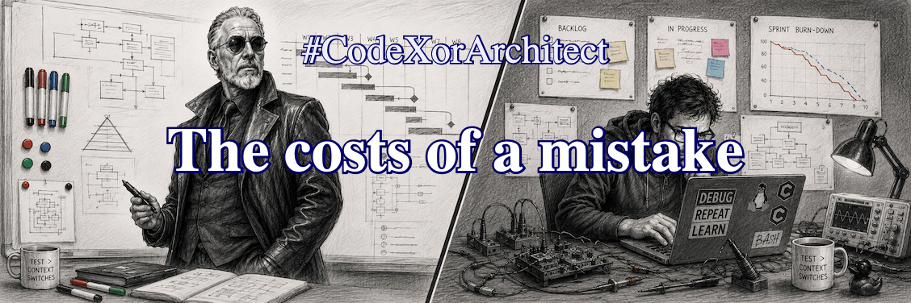

.. Copyright (C) ALbert Mietus, 2026

The costs of a mistake
======================
:Ready: 13/Aug 2026
:Posted: 2/Sept 2026
:reading-time: 59 sec
:LinkedIn: https://lnkd.in/p/eYPJtsPc
.. 236 words from here

A typical code bug takes between one hour and one week to solve. Annoying, but the costs are minor --- a
few thousand euros at most. Sure, a bug escaping your sprint is a bit more expensive. And once it
hits production, it can increase sevenfold.

But what about an architectural mistake? Let’s be honest: it is just as easy to make. Just a few lines in a 256-page
document. But if it’s a real architectural error, it is fundamentally wrong! Let us take a trivial example: choosing the
(wrong) programming environment for a new, modern Embedded System. That can be the OS, the language, or an open-source
library.
And yes, those mistakes have been made ...

Here is an untold story: after 300 man-years of effort, it simply didn't work! It never will.
|BR|
The only solution was to adjust one single paragraph in the initial architecture; maybe an hour’s
work. But it implied throwing everything away, mourning the loss, and starting all over again.
Slightly more expensive!

What does that teach us?
|BR|
Sometimes small details are really important. For the product you work on, and for your career!

Surely, haste is never a great driver. I wouldn't welcome a delay of a few initial sprints when I’m leading from the
process-axis. But when I have to choose between taking 2 extra weeks to get the architecture bug-free, and burning 300
man-years, it’s an easy choice.
