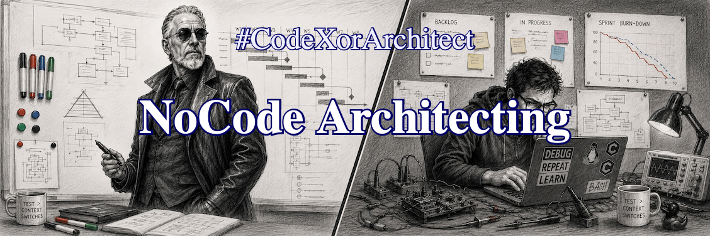

.. Copyright (C) ALbert Mietus, 2026

NoCode Architecting
===================

.. post:: 22/Sept/2026
   :tags: CodeXorArchitect
   :category: LinkedIn-Post

   :reading-time:  1min13
   :LinkedIn: 		https://lnkd.in/p/eni5fszP

   An architect isn't a bricklayer, so why should a software architect write code? Don’t they have more important work?
   This is a hard question and depends heavily on subjective personal preferences. But avoiding the question degrades
   the craft.
   |BR|
   So, what is a *genuine embedded systems/software architect*? And how do you become one?

Let us start with the goal of a software team: produce code --- the asset that brings value. Other activities
are **‘overhead’**, unless they increase the yield.  This gives us a simple guideline for the worth of non-coding
tasks. Every hour of labor the architect spends should (all in all) deliver more than an hour of coding. Given their
costs, even more is expected.
|BR|
Therefore, architects shouldn't just code.

As shown in the ':ref:`3Amigos_P1`' series, the architect role can be defined with levels. It starts with 'L1': an
aspiring part-time architect.
|BR|
The *required* architect's level is dictated by the product’s size & complexity, and the team’s maturity.
A small product with very experienced developers doesn't demand a full-time architect; an *L1* will do. With many young
coworkers, you need more maturity ---maybe an *L2* or *L3*. For a multidisciplinary product with (sub)teams, the
bar should be raised further ---like an *L5* or above.
|BR|
The higher your 'Level', the less time you have for coding.

When your ambition is to grow as an architect, and you start coding ... Stop!  Think for a minute. Maybe someone else can do
it ---perhaps even cheaper.  When you spend 1 hour coaching 2 juniors to make them 3% more effective, you more than
double your value! Do the math: You get the same code this sprint. And next sprint, even more.
|BR|
Then, you did *more important work*!

..  LocalWords:  TechFluencer Architecting NoCode LocalWords CTO CodeXorArchitect
