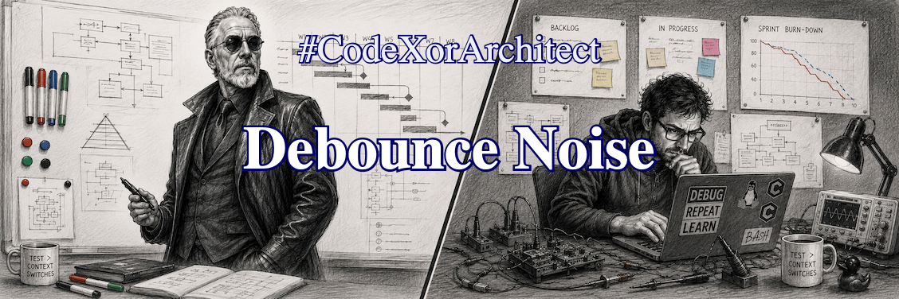

.. Copyright (C) ALbert Mietus, 2026

Debounce Noise
==============

.. post:: 29/Sept/2026
   :tags: CodeXorArchitect
   :category: LinkedIn-Post

   :reading-time:	1min19
   :LinkedIn: 		https://lnkd.in/p/erCkP23a

   .. 317 words from here

   Everybody likes to push buttons. And every engineer knows you must debounce them to avoid noise. But who
   decides how to do that? Is there a best strategy?  Today we do a deep dive and consider all details that might be
   architecturally important.
   |BR|
   And, as we will see, we might even find some noise in the organization.

Roughly, there are two options: an (RC) filter in electronics or a bit of software --- both with several variants. Both
an electrical engineer and an (embedded) software professional can implement them in a couple of hours.
|BR|
But which *technical* solution is ‘the best option’? And what is ‘best’?

Suppose we are designing a high-volume, long-lasting, luxurious, self-powered device. This implies the ‘BOM’ should be
low, and that it runs *for years* on a battery, possibly using energy harvesting.
|BR|
Now look at those buttons again: how can we minimize cost and power use at the same time?

Any solution with fewer components will be cheaper --- that votes for a software solution. But software needs an active
processor --- while low power calls for ‘deep sleep’. Polling the switch every 10ms will drain the battery!
|BR|
A filter doesn't use energy --- unless the button is pressed.

Long story short: You need an estimate of how often & how long the buttons are pressed to calculate the µAh used every
day and per *push*.  Also, technical details --- like how the buttons are connected to the MCU and the exact (software)
algorithm --- are needed to estimate how often the processor will be awake.
|BR|
Then you can determine the best option!

There is one other option, with two possible outcomes --- here comes the noise. Leave it to the two departments. Either
the engineers solve it, or the bureaucrats know it's the other side's issue...
|BR|
Therefore, a great embedded systems architect will solve it long before that.

-----

#CodeXorArchitect --- Your #TechFluencer

..  LocalWords:  TechFluencer debounce  µC MCU
