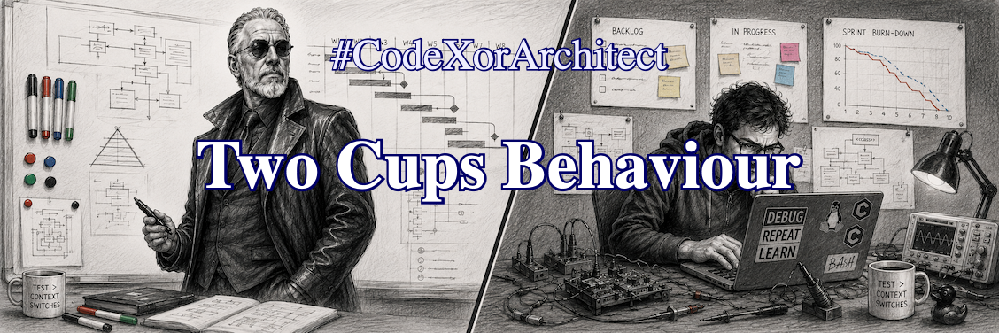

.. Copyright (C) ALbert Mietus, 2026

Two Cups Behaviour
==================

.. post:: 6/Oct 2026
   :tags: CodeXorArchitect
   :category: LinkedIn-Post

   :reading-time:	1min31
   :LinkedIn: 		https://lnkd.in/p/egnF9kUR

   I always wonder why the *Ultimo Superior Brewmaster* luxury coffee machines only discover they are low on water after
   brewing the first shot when the double-cup option is selected. Its water sensor can differentiate between espresso
   and regular coffee, but somehow it forgets that two cups need more water too.
   |BR|
   What a stupid behaviour!

Without a doubt, it's a software flaw --- after all, almost all *mis*\behaviour is software-related. Still, when I ask my
development team (or actually: my training class), all TDD tests pass. The problem isn't in the code, however. It's
about how we deal with constantly changing features. When the water sensor story is long 'done' before the "double"
option is requested, we tend to implement just that one, and some new tests.

Unlike in the old days, ---when architecture and design were finished before coding started--- we now do all phases
concurrently in each sprint. As nobody asked for the combination, both features will work, but not together.
|BR|
TDD, when applied correctly, defines and validates the technical parts needed for the device. It proves the code is
correct, **not** that we build the right system.

How can we solve this unintentional behaviour? That is simple: describe it. Not only what we need, but also what we
dislike.  "*Given two cups of coffee are selected, and there is enough water, then both cups are made in one go*", and
"When the water level is low, ask the user to fill the tank before starting to brew".
|BR|
A BDD expert can phrase it more formally. But even those informal 'needs' will drive the engineers in the right direction!

With a nested double-loop of *Behaviour-* and *Test-Driven Development* ('B&TDD'), system-level tests drive the
requested behaviour of the parts and thus define the TDD tests --- even when extra stories are added later.
|BR|
This yields structure, just like the old architecture documents did.

Architecture isn't just technology; it’s about solutions that make the machinery work.
|BR|
To become a genuine architect, you should learn to coach your team to follow the *discipline of engineering*.  That is
why I designed this "USB-practice" carefully.  It's no wonder the machinery never works; it is an intended pitfall:-)

.. caution::

   This *‘USB’ practice* is part of my *“1B+4D”* training. It is a (software) design coaching line for (technical,
   “engineering”) software engineers who want to mature. Here, it’s used as an example of how architects can guide
   their team.
   |BR|
   I have other classes, like ‘3Amigos’, that are more suited for architects.

   If you are interested, I’m thinking about offering an open class in 2026Q4 (or 2027Q1).  Contact me when you'd like
   to participate!

   .. seealso::

      * My notes for 3Amigos: :ref:`3Amigos_P1`
      * :ref:`1B_4D` isn’t online yet

---

..  LocalWords:  TechFluencer Brewmaster  BDD TTD ALbert
